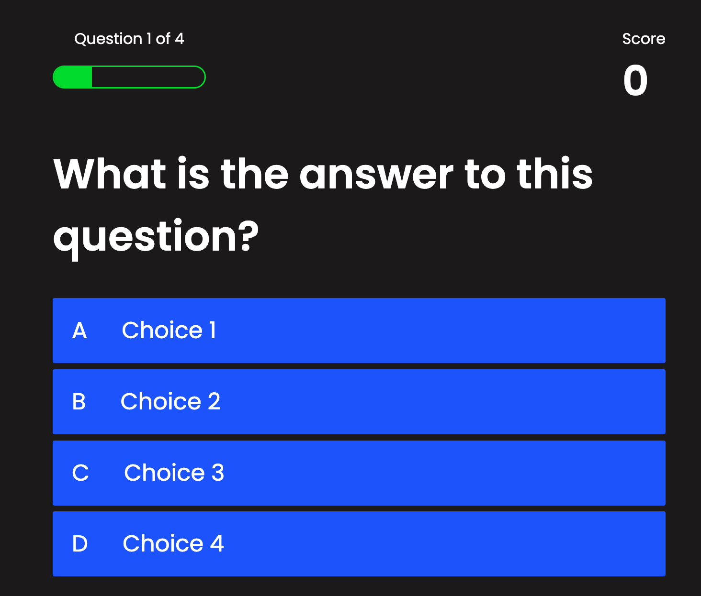

# Multiple Choice Quiz

## Description
A quiz application that utilizes client-side storage to save quiz scores.  

## Technologies Used
HTML, CSS, JavaScript
      
## Screenshot

## Questions
Visit my GitHub page! [RobertRish](https://github.com/RobertRish)
If you have questions feel free to reach out!: robert.rish1225@gmail.com